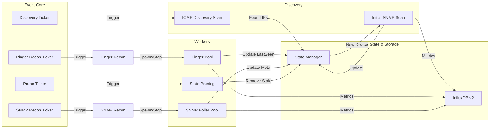

# netscan


**netscan** is a high-performance network monitoring service designed for scale and reliability. It combines automated device discovery with real-time uptime monitoring and metadata enrichment, all powered by a robust event-driven architecture.

---

## 🚀 Key Features

*   **🔍 Automated Discovery**: Randomized ICMP sweeps across multiple subnets to automatically find new devices.
*   **⚡ Real-Time Monitoring**: High-concurrency pinger engine capable of monitoring 20,000+ devices.
*   **📝 SNMP Enrichment**: Automatically detects hostnames and system descriptions for discovered devices.
*   **🛡️ Resilient Architecture**: Built-in circuit breakers, rate limiters, and self-healing reconciliation loops.
*   **📊 InfluxDB Integration**: Native support for InfluxDB v2, separating operational metrics from health telemetry.
*   **🔒 Secure Deployment**: Supports rootless execution via capability-based security (`CAP_NET_RAW`).

---

## 🏗️ Architecture

netscan uses a multi-ticker event loop to manage independent workflows for discovery, monitoring, and state management.



---

## 🐳 Docker Quick Start

Get up and running in minutes with the pre-configured Docker stack.

### Prerequisites
*   Docker Engine 20.10+
*   Docker Compose V2

### 1. Clone & Configure
```bash
git clone https://github.com/kljama/netscan.git
cd netscan

# Create config files
cp config.yml.example config.yml
cp .env.example .env
```

### 2. Set Your Network Range
Open `config.yml` and set your **actual** network CIDR.
```yaml
networks:
  - "192.168.1.0/24"  # <--- Change this to your network!
```

### 3. Launch
```bash
docker compose up -d
```
Access the **InfluxDB UI** at `https://localhost` (User: `admin`, Pass: `admin123`).

---

## 🛠️ Deployment Options

| Method | Best For | Description |
|--------|----------|-------------|
| **Docker Compose** | Testing & Small Prod | Easiest setup. Orchestrates netscan + InfluxDB together. |
| **Native Systemd** | Production Security | Runs as dedicated user with minimal capabilities. |

> See **[MANUAL.md](MANUAL.md)** for detailed deployment guides, security hardening, and configuration references.

---

## 🔍 Verification

Check if the service is running correctly:

```bash
# View live logs
docker compose logs -f netscan

# Check health endpoint
curl http://localhost:8080/health
```

---

## 📜 License

MIT License - See [LICENSE.md](LICENSE.md)
